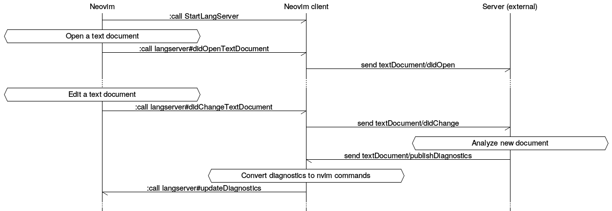
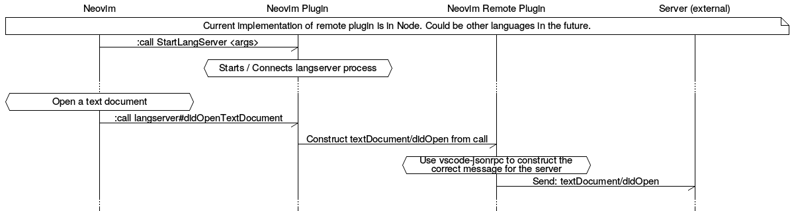

# nvim-langserver-shim

Shim for the language server protocol developed by Microsoft. The protocol can be found here: https://github.com/Microsoft/language-server-protocol

## Sample Process

Simplified example:

More detailed example

## Plans

- [ ] Use `jsonrpc` from `vscode-languageserver-node` to communicate to a server.
- [ ] Make a remote plugin that uses the `jsonrpc`
- [ ] Make a test server to run some of these tests against (hopefully found somewhere)
- [ ] Functions to make messages / message dictionaries quickly in Neovim.
- [ ] Implement various actions in (similar to) this order:
    - [ ] Go to definition: https://github.com/Microsoft/language-server-protocol/blob/master/protocol.md#goto-definition-request
    - [ ] Find references: https://github.com/Microsoft/language-server-protocol/blob/master/protocol.md#find-references-request
    - [ ] Highlights:
    - [ ] Completion:
        - [ ] Then deoplete source for completion
- [ ] Document the nvim api -> microsoft protocol
    - [ ] Allow for different implementations of the nvim side?
